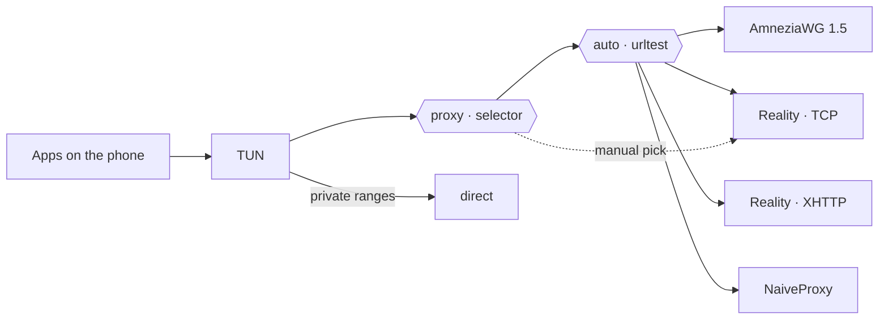

<div align="center">

# ZGRNK

**One Android app. Four transports. One tap to switch.**

A custom build of [sing-box for Android](https://github.com/SagerNet/sing-box-for-android) on top of the
[sing-box-extended](https://github.com/shtorm-7/sing-box-extended) core — AmneziaWG, VLESS + Reality (TCP and XHTTP)
and NaiveProxy side by side in a single profile, with automatic selection of the fastest path.

[](https://github.com/zzeygarnik/sing-box-extended/releases/latest)
[](https://github.com/zzeygarnik/sing-box-extended/actions/workflows/zgrnk-android.yml)
[](#install)
[](#install)
[](LICENSE)

**English** · [Русский](README.ru.md)

[Download APK](https://github.com/zzeygarnik/sing-box-extended/releases/latest) ·
[Profile templates](zgrnk/examples) ·
[What's changed vs upstream](#whats-different-from-upstream)

</div>

<!--
Screenshots go here once added to docs/screenshots/:

<p align="center">
  
  
  
</p>
-->

---

## Transports

| | Transport | Runs over | What it brings |
|---|---|---|---|
| 🛡️ | **AmneziaWG 1.5** | UDP | WireGuard with junk packets, padded handshakes (S1–S4), custom message headers (H1–H4), `I1` signature packets and random trailers. Upstream handshake bug fixed in this build. |
| ⚡ | **VLESS + Reality · TCP** | TCP / TLS 1.3 | Raw TCP with the `xtls-rprx-vision` flow and a Chrome uTLS fingerprint. Lowest overhead of the TLS-based options. |
| 🌊 | **VLESS + Reality · XHTTP** | TCP / TLS 1.3, HTTP/2 | Xray's XHTTP transport (`stream-one`) with randomized request padding. Looks like a regular long-lived HTTP/2 stream. |
| 🧭 | **NaiveProxy** | TCP / TLS, HTTP/2 | HTTP `CONNECT` tunnel built on Chromium's network stack, so the TLS handshake is a genuine browser one. |

All four live in one profile. A `urltest` group probes them every 3 minutes and routes through the fastest,
and a `selector` lets you pin any single transport by hand from the **Groups** tab.



## Features

- **Everything in one app** — no juggling separate WireGuard, Xray and Naive clients.
- **Automatic failover** — if one transport stops responding, `urltest` moves traffic to the next one on its own.
- **Per-app split tunneling** — send only chosen apps through the tunnel, or exclude the ones that must go direct.
- **DNS over HTTPS through the tunnel** — the system resolver is only used to find the servers themselves.
- **Local network stays local** — private address ranges bypass the tunnel.
- **Installs next to stock SFA** — its own package id (`io.nekohasekai.sfa.zgrnk`), so it doesn't replace or conflict with other sing-box builds.
- **Reproducible builds** — every APK comes from the public [GitHub Actions workflow](.github/workflows/zgrnk-android.yml) and is signature-checked before upload.

## Install

1. Download `SFA-*-zgrnk.*-arm64-v8a.apk` from the [latest release](https://github.com/zzeygarnik/sing-box-extended/releases/latest).
2. Open it on the phone and allow installing from unknown sources when asked.
3. Requirements: Android 7.0 or newer, 64-bit ARM (`arm64-v8a`) — practically every phone from the last several years.

Updates install over the previous version in place; profiles are kept.

## Set up a profile

The app takes native **sing-box JSON** profiles (not `vless://` links or raw WireGuard `.conf` files).

1. Take a template from [`zgrnk/examples`](zgrnk/examples):

   | File | Contents |
   |---|---|
   | [`all-in-one.json`](zgrnk/examples/all-in-one.json) | All four transports + auto selection. Start here. |
   | [`amneziawg.json`](zgrnk/examples/amneziawg.json) | AmneziaWG 1.5 only |
   | [`vless-reality-tcp.json`](zgrnk/examples/vless-reality-tcp.json) | VLESS + Reality over raw TCP (Vision) |
   | [`vless-reality-xhttp.json`](zgrnk/examples/vless-reality-xhttp.json) | VLESS + Reality over XHTTP |
   | [`naiveproxy.json`](zgrnk/examples/naiveproxy.json) | NaiveProxy only |

2. Replace every `<placeholder>`, the `example.com` hostnames and the ports with your server's values.
   Remove the transports you don't run from `all-in-one.json` — and from both group lists.
3. In the app: **Profiles → New Profile → Import** and pick the file. Then select the profile and tap **Start**.

### Things worth knowing

<details>
<summary><b>AmneziaWG</b> — parameters must match the server exactly</summary>

- `jc`, `jmin`, `jmax`, `s1`–`s4`, `h1`–`h4` and `i1` in the template are **example values**. Copy the real ones from the server
  (`awg show` or the `[Interface]` section of its config). A single mismatch and the handshake silently never completes.
- Keep `"random_trailers": true` if the server has `RandomTrailers = on`.
- WireGuard is an **endpoint** in sing-box ≥ 1.11, not an outbound. It's referenced by tag in groups and routes like any outbound.
- `mtu: 1280` is a safe default for mobile networks.
- One WireGuard key = one active device. If two clients use the same peer at the same time, the latest handshake wins and the other one drops.

</details>

<details>
<summary><b>XHTTP</b> — <code>x_padding_bytes</code> is required</summary>

This core rejects an XHTTP transport without `x_padding_bytes` (`x_padding_bytes cannot be disabled`). The value is a
client-side range such as `"100-1000"`; the server doesn't need a matching setting. `mode: stream-one` works against
an Xray server in `auto` mode.

</details>

<details>
<summary><b>NaiveProxy</b> — why UDP/443 is rejected</summary>

NaiveProxy carries TCP only. The template rejects UDP to port 443 so apps that try QUIC first fall back to TCP immediately
instead of waiting for a timeout.

</details>

<details>
<summary><b>Split tunneling</b> — where the setting is</summary>

**Settings → Profile Override → Per-App Proxy.** Choose *Include* (only the listed apps use the tunnel) or *Exclude*
(everything except the listed apps). The list applies to all profiles. On Xiaomi / HyperOS, allow the app to read the list
of installed apps first, otherwise the picker is empty. In JSON the same thing is `tun.include_package` / `tun.exclude_package`.

</details>

### Server side

Any standard server stack works — nothing custom is required:

| Transport | Server |
|---|---|
| AmneziaWG 1.5 | [amneziawg-go](https://github.com/amnezia-vpn/amneziawg-go) / amneziawg-tools with S3/S4, I1 and RandomTrailers |
| VLESS + Reality (TCP, XHTTP) | [Xray-core](https://github.com/XTLS/Xray-core) VLESS inbound with `realitySettings` |
| NaiveProxy | [Caddy](https://caddyserver.com) built with [forwardproxy@naive](https://github.com/klzgrad/forwardproxy) |

## What's different from upstream

This branch (`zgrnk`) is based on `shtorm-7/sing-box-extended` tag `v1.14.0-extended-2.7.1`.

| Change | Where |
|---|---|
| **`random_trailers` exposed in config.** The engine already supported it, but the sing-box glue had no JSON field for it, so it could never be turned on. Without it the client can't talk to a server that has random trailers enabled. | [`3478e3d6`](https://github.com/zzeygarnik/sing-box-extended/commit/3478e3d6) · `option/wireguard.go`, `transport/wireguard/`, `protocol/wireguard/` |
| **AmneziaWG handshake fix.** With random trailers on, the upstream engine sliced the send buffer past the fixed message size, `marshal` failed its length check and the error was discarded — handshake initiation, response and cookie reply went out with an all-zero body. Fixed in a separate engine fork, tag [`v0.0.5-extended-1.6.1-zgrnk.1`](https://github.com/zzeygarnik/wireguard-go/tree/v0.0.5-extended-1.6.1-zgrnk.1). | [`d72dcbbd`](https://github.com/zzeygarnik/sing-box-extended/commit/d72dcbbd) · `go.mod` → [zzeygarnik/wireguard-go](https://github.com/zzeygarnik/wireguard-go) |
| **Android app pinned to SFA 1.14.0** (`5d5479d`), matching the 1.14 core, plus a stub for the one platform method the extended core adds. | [`193e129b`](https://github.com/zzeygarnik/sing-box-extended/commit/193e129b) · [`zgrnk/sfa-patches`](zgrnk/sfa-patches) |
| **Own package id and name** (`io.nekohasekai.sfa.zgrnk`, "ZGRNK") so it installs alongside other builds. | [`zgrnk/sfa-patches`](zgrnk/sfa-patches) |
| **CI build** of a signed arm64 APK on every push to `zgrnk`. | [`.github/workflows/zgrnk-android.yml`](.github/workflows/zgrnk-android.yml) |

Everything else in the core is untouched, so all of sing-box-extended's protocols are available to hand-written profiles too.

<details>
<summary>Also in the core (from sing-box-extended)</summary>

WARP, MASQUE, MTProxy, Mieru, TrustTunnel, Sudoku, SSH, VPN, Bond, Fallback, Failover · SDNS (DNSCrypt), DNS Fallback ·
mKCP, XHTTP, Rmux · Amnezia 3.0, VLESS encryption · outbound providers and share-link parser.
Full list and examples: [shtorm-7/sing-box-extended](https://github.com/shtorm-7/sing-box-extended#-features).

</details>

## Build from source

The [workflow](.github/workflows/zgrnk-android.yml) is the reference. Locally, with Go 1.26.7, Android NDK r28 and JDK 17:

```bash
# 1. core -> libbox.aar
make lib_install
go run ./cmd/internal/build_libbox -target android -platform android/arm64

# 2. app at the pinned SFA commit, with the ZGRNK patches
git clone https://github.com/SagerNet/sing-box-for-android sfa
git -C sfa checkout 5d5479d8bb60f7eb45e86402a8aa3a6131dd9ba3
for p in zgrnk/sfa-patches/*.patch; do git -C sfa apply "../$p"; done
mkdir -p sfa/app/libs && cp libbox.aar libbox-legacy.aar sfa/app/libs/

# 3. APK (needs your own keystore, see SFA's signing setup)
cd sfa && ./gradlew :app:assembleOtherRelease
```

Use the `other` flavor — it's the one that includes NaiveProxy.

## Credits

- [SagerNet/sing-box](https://github.com/SagerNet/sing-box) and [sing-box for Android](https://github.com/SagerNet/sing-box-for-android) — the platform and the app
- [shtorm-7/sing-box-extended](https://github.com/shtorm-7/sing-box-extended) — the extended core this build is based on
- [Amnezia VPN](https://github.com/amnezia-vpn), [XTLS/Xray-core](https://github.com/XTLS/Xray-core), [klzgrad/naiveproxy](https://github.com/klzgrad/naiveproxy) — the protocols

Unofficial build, not affiliated with SagerNet or the sing-box-extended authors.

## License

[GPL-3.0](LICENSE), inherited from sing-box.
