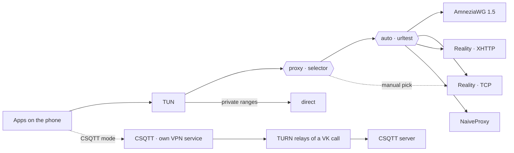

<div align="center">

# ZGRNK

**One Android app. Five transports. One tap to switch.**

A custom build of [sing-box for Android](https://github.com/SagerNet/sing-box-for-android) on top of the
[sing-box-extended](https://github.com/shtorm-7/sing-box-extended) core — AmneziaWG, VLESS + Reality (TCP and XHTTP)
and NaiveProxy side by side in a single profile with automatic selection of the fastest path, plus a built-in
[CSQTT](https://github.com/amurcanov/csqtt) mode that tunnels over the TURN relays of a VK call.

[](https://github.com/zzeygarnik/sing-box-extended/releases/latest)
[](https://github.com/zzeygarnik/sing-box-extended/actions/workflows/zgrnk-android.yml)
[](#install)
[](#install)
[](#license)

**English** · [Русский](README.ru.md)

[Download APK](https://github.com/zzeygarnik/sing-box-extended/releases/latest) ·
[Profile templates](zgrnk/examples) ·
[CSQTT mode](#csqtt-mode) ·
[What's changed vs upstream](#whats-different-from-upstream)

</div>

<!--
Screenshots go here once added to docs/screenshots/:

<p align="center">
  
  
  
</p>
-->

---

## Transports

| | Transport | Runs over | What it brings |
|---|---|---|---|
| 🛡️ | **AmneziaWG 1.5** | UDP | WireGuard with junk packets, padded handshakes (S1–S4), custom message headers (H1–H4), `I1` signature packets and random trailers. Upstream handshake bug fixed in this build. |
| ⚡ | **VLESS + Reality · TCP** | TCP / TLS 1.3 | Raw TCP with the `xtls-rprx-vision` flow and a Chrome uTLS fingerprint. Lowest overhead of the TLS-based options. |
| 🌊 | **VLESS + Reality · XHTTP** | TCP / TLS 1.3, HTTP/2 | Xray's XHTTP transport (`stream-one`) with randomized request padding. Looks like a regular long-lived HTTP/2 stream. |
| 🧭 | **NaiveProxy** | TCP / TLS, HTTP/2 | HTTP `CONNECT` tunnel built on Chromium's network stack, so the TLS handshake is a genuine browser one. |
| 📞 | **CSQTT** | UDP via TURN relays | Multi-threaded L3 tunnel carried through the TURN relays of a VK call, shaped like encrypted call media. Runs as its own VPN mode, [see below](#csqtt-mode). |

The first four live in one sing-box profile. A `urltest` group probes them every 3 minutes and routes through the fastest,
and a `selector` lets you pin any single transport by hand from the **Groups** tab. CSQTT is a separate engine with
its own VPN service, started from **Tools → CSQTT**. Only one of the two modes runs at a time.



## Features

- **Everything in one app** — no juggling separate WireGuard, Xray, Naive and CSQTT clients.
- **Automatic failover** — if one transport stops responding, `urltest` moves traffic to the next one on its own.
- **Per-app split tunneling** — send only chosen apps through the tunnel, or exclude the ones that must go direct.
- **DNS over HTTPS through the tunnel** — the system resolver is only used to find the servers themselves.
- **Local network stays local** — private address ranges bypass the tunnel.
- **Installs next to stock SFA** — its own package id (`io.nekohasekai.sfa.zgrnk`), name and icon, so it doesn't replace or conflict with other sing-box builds.
- **Reproducible builds** — every APK comes from the public [GitHub Actions workflow](.github/workflows/zgrnk-android.yml) and is signature-checked before upload. The bundled CSQTT binary is pinned by sha256 to an upstream release.

## Install

1. Download `SFA-*-zgrnk.*-arm64-v8a.apk` from the [latest release](https://github.com/zzeygarnik/sing-box-extended/releases/latest).
2. Open it on the phone and allow installing from unknown sources when asked.
3. Requirements: Android 7.0 or newer, 64-bit ARM (`arm64-v8a`) — practically every phone from the last several years.

Updates install over the previous version in place; profiles and CSQTT settings are kept.

## Set up a profile

The app takes native **sing-box JSON** profiles (not `vless://` links or raw WireGuard `.conf` files).

1. Take a template from [`zgrnk/examples`](zgrnk/examples):

   | File | Contents |
   |---|---|
   | [`all-in-one.json`](zgrnk/examples/all-in-one.json) | All four sing-box transports + auto selection. Start here. |
   | [`amneziawg.json`](zgrnk/examples/amneziawg.json) | AmneziaWG 1.5 only |
   | [`vless-reality-tcp.json`](zgrnk/examples/vless-reality-tcp.json) | VLESS + Reality over raw TCP (Vision) |
   | [`vless-reality-xhttp.json`](zgrnk/examples/vless-reality-xhttp.json) | VLESS + Reality over XHTTP |
   | [`naiveproxy.json`](zgrnk/examples/naiveproxy.json) | NaiveProxy only |

2. Replace every `<placeholder>`, the `example.com` hostnames and the ports with your server's values.
   Remove the transports you don't run from `all-in-one.json` — and from both group lists.
3. In the app: **Profiles → New Profile → Import** and pick the file. Then select the profile and tap **Start**.

### Things worth knowing

<details>
<summary><b>AmneziaWG</b> — parameters must match the server exactly</summary>

- `jc`, `jmin`, `jmax`, `s1`–`s4`, `h1`–`h4` and `i1` in the template are **example values**. Copy the real ones from the server
  (`awg show` or the `[Interface]` section of its config). A single mismatch and the handshake silently never completes.
- Keep `"random_trailers": true` if the server has `RandomTrailers = on`.
- WireGuard is an **endpoint** in sing-box ≥ 1.11, not an outbound. It's referenced by tag in groups and routes like any outbound.
- `mtu: 1280` is a safe default for mobile networks.
- One WireGuard key = one active device. If two clients use the same peer at the same time, the latest handshake wins and the other one drops.

</details>

<details>
<summary><b>XHTTP</b> — <code>x_padding_bytes</code> is required</summary>

This core rejects an XHTTP transport without `x_padding_bytes` (`x_padding_bytes cannot be disabled`). The value is a
client-side range such as `"100-1000"`; the server doesn't need a matching setting. `mode: stream-one` works against
an Xray server in `auto` mode.

</details>

<details>
<summary><b>NaiveProxy</b> — why UDP/443 is rejected</summary>

NaiveProxy carries TCP only. The template rejects UDP to port 443 so apps that try QUIC first fall back to TCP immediately
instead of waiting for a timeout.

</details>

<details>
<summary><b>Split tunneling</b> — where the setting is</summary>

**Settings → Profile Override → Per-App Proxy.** Choose *Include* (only the listed apps use the tunnel) or *Exclude*
(everything except the listed apps). The list applies to all profiles. On Xiaomi / HyperOS, allow the app to read the list
of installed apps first, otherwise the picker is empty. In JSON the same thing is `tun.include_package` / `tun.exclude_package`.

</details>

## CSQTT mode

CSQTT isn't a sing-box protocol, so it doesn't use JSON profiles. It has its own screen: **Tools → CSQTT**.
The screen is in Russian, like the upstream client; the English meaning is in brackets.

| Field | What to enter |
|---|---|
| **Сервер (host:port)** (server) | Your CSQTT server. The port can be left out, it defaults to `46000`. |
| **Пароль подключения** (password) | A per-device password created in the server's web panel (**Клиенты → Создать доступ**, "Clients → Create access"). |
| **VK-хеши звонков** (VK call hashes) | One to six hashes, one per line — the last part of a VK call link (`vk.com/call/join/<hash>`). |
| **Fingerprint / Obfs / TURN transport** | Leave the defaults unless you know you need something else. |

Tap **Подключить** (connect). The settings are saved on the device and hidden while the tunnel is up; they come back the
next time you open the screen. The log at the bottom shows the engine's own output and can be copied with one tap.

<details>
<summary><b>Call hashes</b> — how they behave</summary>

- To get a hash, create a call in VK with the waiting room **off** and anonymous joining **on**, then copy its link.
  The call tab doesn't need to stay open.
- Each hash is used independently. If one call stops working, the others keep carrying traffic. Replace the dead hash
  with a new one on the phone — nothing changes on the server, it never sees or checks the hashes.
- More hashes = more parallel relay paths.

</details>

<details>
<summary><b>Passwords</b> — one per device</summary>

A password binds itself to the first device that connects with it. Create a separate entry in the panel for every
phone or computer, otherwise the second device gets `device_mismatch`. Extending an entry's expiry in the panel keeps the
same password and binding.

</details>

<details>
<summary><b>Captcha</b> — when VK asks for one</summary>

The app first tries to solve it automatically in a hidden WebView. If that fails, a captcha screen opens so you can
solve it by hand. Either way the tunnel continues on its own afterwards.

</details>

<details>
<summary><b>Switching modes</b></summary>

Starting CSQTT stops a running sing-box profile, and starting a profile stops CSQTT — Android allows only one VPN at a
time. Just tap **Start** or **Подключить** in whichever mode you want.

</details>

For Windows and Linux there's a separate desktop client of the same protocol:
[luminescq/focsq](https://github.com/luminescq/focsq).

### Server side

Any standard server stack works — nothing custom is required:

| Transport | Server |
|---|---|
| AmneziaWG 1.5 | [amneziawg-go](https://github.com/amnezia-vpn/amneziawg-go) / amneziawg-tools with S3/S4, I1 and RandomTrailers |
| VLESS + Reality (TCP, XHTTP) | [Xray-core](https://github.com/XTLS/Xray-core) VLESS inbound with `realitySettings` |
| NaiveProxy | [Caddy](https://caddyserver.com) built with [forwardproxy@naive](https://github.com/klzgrad/forwardproxy) |
| CSQTT | The server from [amurcanov/csqtt](https://github.com/amurcanov/csqtt) (UDP, default port `46000`, web panel for per-device passwords) |

## What's different from upstream

This branch (`zgrnk`) is based on `shtorm-7/sing-box-extended` tag `v1.14.0-extended-2.7.1`.

| Change | Where |
|---|---|
| **`random_trailers` exposed in config.** The engine already supported it, but the sing-box glue had no JSON field for it, so it could never be turned on. Without it the client can't talk to a server that has random trailers enabled. | [`3478e3d6`](https://github.com/zzeygarnik/sing-box-extended/commit/3478e3d6) · `option/wireguard.go`, `transport/wireguard/`, `protocol/wireguard/` |
| **AmneziaWG handshake fix.** With random trailers on, the upstream engine sliced the send buffer past the fixed message size, `marshal` failed its length check and the error was discarded — handshake initiation, response and cookie reply went out with an all-zero body. Fixed in a separate engine fork, tag [`v0.0.5-extended-1.6.1-zgrnk.1`](https://github.com/zzeygarnik/wireguard-go/tree/v0.0.5-extended-1.6.1-zgrnk.1). | [`d72dcbbd`](https://github.com/zzeygarnik/sing-box-extended/commit/d72dcbbd) · `go.mod` → [zzeygarnik/wireguard-go](https://github.com/zzeygarnik/wireguard-go) |
| **CSQTT mode.** A minimal Kotlin port of the upstream CSQTT Android client (VPN service, process manager, event parser, auto and manual captcha, encrypted settings store) plus a Material 3 screen under Tools. The engine is upstream's own `libclient.so` from release `v2.1.9`, fetched by CI and checked against a pinned sha256. Starting either mode stops the other. | [`54059fcd`](https://github.com/zzeygarnik/sing-box-extended/commit/54059fcd) and follow-up fixes · [`zgrnk/sfa-overlay`](zgrnk/sfa-overlay) · [`0004-csqtt-hooks.patch`](zgrnk/sfa-patches/0004-csqtt-hooks.patch) |
| **Android app pinned to SFA 1.14.0** (`5d5479d`), matching the 1.14 core, plus a stub for the one platform method the extended core adds. | [`193e129b`](https://github.com/zzeygarnik/sing-box-extended/commit/193e129b) · [`zgrnk/sfa-patches`](zgrnk/sfa-patches) |
| **Own package id, name and icon** (`io.nekohasekai.sfa.zgrnk`, "ZGRNK") so it installs alongside other builds. | [`zgrnk/sfa-patches`](zgrnk/sfa-patches) · [`zgrnk/icon`](zgrnk/icon) |
| **CI build** of a signed arm64 APK on every push to `zgrnk`. | [`.github/workflows/zgrnk-android.yml`](.github/workflows/zgrnk-android.yml) |

Everything else in the core is untouched, so all of sing-box-extended's protocols are available to hand-written profiles too.

<details>
<summary>Also in the core (from sing-box-extended)</summary>

WARP, MASQUE, MTProxy, Mieru, TrustTunnel, Sudoku, SSH, VPN, Bond, Fallback, Failover · SDNS (DNSCrypt), DNS Fallback ·
mKCP, XHTTP, Rmux · Amnezia 3.0, VLESS encryption · outbound providers and share-link parser.
Full list and examples: [shtorm-7/sing-box-extended](https://github.com/shtorm-7/sing-box-extended#-features).

</details>

## Build from source

The [workflow](.github/workflows/zgrnk-android.yml) is the reference. Locally, with Go 1.26.7, Android NDK r28 and JDK 17:

```bash
# 1. core -> libbox.aar
make lib_install
go run ./cmd/internal/build_libbox -target android -platform android/arm64

# 2. app at the pinned SFA commit, with the ZGRNK overlay, icon and patches
git clone https://github.com/SagerNet/sing-box-for-android sfa
git -C sfa checkout 5d5479d8bb60f7eb45e86402a8aa3a6131dd9ba3
mkdir -p sfa/app/src/main/java/io/nekohasekai/sfa/zgrnk/csqtt
cp zgrnk/sfa-overlay/app/src/main/java/io/nekohasekai/sfa/zgrnk/csqtt/*.kt sfa/app/src/main/java/io/nekohasekai/sfa/zgrnk/csqtt/
# icon: copy zgrnk/icon/{mipmap,drawable}-*/ over sfa/app/src/main/res/ (see the workflow step)
for p in zgrnk/sfa-patches/*.patch; do git -C sfa apply "../$p"; done
mkdir -p sfa/app/libs && cp libbox.aar libbox-legacy.aar sfa/app/libs/

# 3. CSQTT engine from the upstream release (verify the sha256 values from the workflow)
curl -fLo csqtt.apk https://github.com/amurcanov/csqtt/releases/download/v2.1.9/CSQTT-arm64-v8a.apk
unzip -o csqtt.apk lib/arm64-v8a/libclient.so -d csqtt-extract
mkdir -p sfa/app/src/main/jniLibs/arm64-v8a sfa/app/src/main/assets/licenses
cp csqtt-extract/lib/arm64-v8a/libclient.so sfa/app/src/main/jniLibs/arm64-v8a/libcsqtt.so
cp zgrnk/csqtt-license/LICENSE sfa/app/src/main/assets/licenses/CSQTT-LICENSE

# 4. APK (needs your own keystore, see SFA's signing setup)
cd sfa && ./gradlew :app:assembleOtherRelease
```

Use the `other` flavor — it's the one that includes NaiveProxy.

## Credits

- [SagerNet/sing-box](https://github.com/SagerNet/sing-box) and [sing-box for Android](https://github.com/SagerNet/sing-box-for-android) — the platform and the app
- [shtorm-7/sing-box-extended](https://github.com/shtorm-7/sing-box-extended) — the extended core this build is based on
- [amurcanov](https://github.com/amurcanov) — author of CSQTT: the protocol, engine and server ([amurcanov/csqtt](https://github.com/amurcanov/csqtt))
- [Amnezia VPN](https://github.com/amnezia-vpn), [XTLS/Xray-core](https://github.com/XTLS/Xray-core), [klzgrad/naiveproxy](https://github.com/klzgrad/naiveproxy) — the protocols

Unofficial build, not affiliated with SagerNet, the sing-box-extended authors or the CSQTT author.

## License

The source in this repository is [GPL-3.0](LICENSE), inherited from sing-box.

The APK also bundles the CSQTT engine (`libcsqtt.so`, unmodified `libclient.so` from amurcanov/csqtt `v2.1.9`), which is
licensed under [PolyForm Noncommercial 1.0.0](zgrnk/csqtt-license/LICENSE) — **noncommercial use only**. The license text
ships inside the APK as `assets/licenses/CSQTT-LICENSE`.
