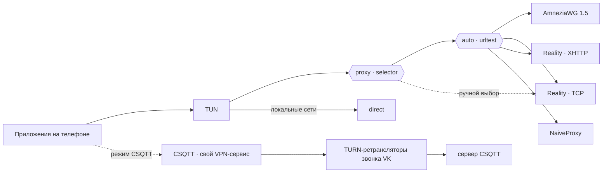

<div align="center">

# ZGRNK

**Одно Android-приложение. Пять транспортов. Переключение в одно касание.**

Своя сборка [sing-box for Android](https://github.com/SagerNet/sing-box-for-android) на ядре
[sing-box-extended](https://github.com/shtorm-7/sing-box-extended) — AmneziaWG, VLESS + Reality (TCP и XHTTP)
и NaiveProxy рядом в одном профиле с автоматическим выбором самого быстрого пути, плюс встроенный режим
[CSQTT](https://github.com/amurcanov/csqtt), который строит туннель через TURN-ретрансляторы звонка VK.

[](https://github.com/zzeygarnik/sing-box-extended/releases/latest)
[](https://github.com/zzeygarnik/sing-box-extended/actions/workflows/zgrnk-android.yml)
[](#установка)
[](#установка)
[](#лицензия)

[English](README.md) · **Русский**

[Скачать APK](https://github.com/zzeygarnik/sing-box-extended/releases/latest) ·
[Шаблоны профилей](zgrnk/examples) ·
[Режим CSQTT](#режим-csqtt) ·
[Отличия от upstream](#отличия-от-upstream)

</div>

<!--
Скриншоты — сюда, когда появятся в docs/screenshots/:

<p align="center">
  
  
  
</p>
-->

---

## Транспорты

| | Транспорт | Поверх чего | Что даёт |
|---|---|---|---|
| 🛡️ | **AmneziaWG 1.5** | UDP | WireGuard с junk-пакетами, паддингом рукопожатий (S1–S4), своими заголовками сообщений (H1–H4), сигнатурными пакетами `I1` и random trailers. Баг рукопожатия из upstream в этой сборке исправлен. |
| ⚡ | **VLESS + Reality · TCP** | TCP / TLS 1.3 | Чистый TCP с flow `xtls-rprx-vision` и uTLS-отпечатком Chrome. Минимальные накладные расходы среди TLS-вариантов. |
| 🌊 | **VLESS + Reality · XHTTP** | TCP / TLS 1.3, HTTP/2 | XHTTP-транспорт Xray (`stream-one`) со случайным паддингом запросов. Выглядит как обычный долгоживущий HTTP/2-поток. |
| 🧭 | **NaiveProxy** | TCP / TLS, HTTP/2 | Туннель через HTTP `CONNECT` на сетевом стеке Chromium — TLS-рукопожатие настоящее браузерное. |
| 📞 | **CSQTT** | UDP через TURN-ретрансляторы | Многопоточный L3-туннель через TURN-ретрансляторы звонка VK, по форме похож на зашифрованный медиатрафик звонка. Работает как отдельный VPN-режим, [подробнее ниже](#режим-csqtt). |

Первые четыре живут в одном профиле sing-box. Группа `urltest` раз в 3 минуты проверяет их и пускает трафик через самый
быстрый, а `selector` позволяет вручную закрепить любой транспорт на вкладке **Groups**. CSQTT — отдельный движок со
своим VPN-сервисом, запускается из **Tools → CSQTT**. Одновременно работает только один из двух режимов.



## Возможности

- **Всё в одном приложении** — не нужно держать отдельные клиенты для WireGuard, Xray, Naive и CSQTT.
- **Автоматический failover** — если транспорт перестал отвечать, `urltest` сам переводит трафик на следующий.
- **Раздельное туннелирование по приложениям** — пустить в туннель только выбранные приложения или исключить те, что должны идти напрямую.
- **DNS over HTTPS через туннель** — системный резолвер используется только чтобы найти сами серверы.
- **Локальная сеть остаётся локальной** — приватные диапазоны адресов идут мимо туннеля.
- **Ставится рядом с обычным SFA** — свой package id (`io.nekohasekai.sfa.zgrnk`), название и иконка, не заменяет и не конфликтует с другими сборками sing-box.
- **Воспроизводимые сборки** — каждый APK собирается публичным [GitHub Actions workflow](.github/workflows/zgrnk-android.yml), подпись проверяется перед выгрузкой. Встроенный бинарник CSQTT закреплён по sha256 за релизом upstream.

## Установка

1. Скачай `SFA-*-zgrnk.*-arm64-v8a.apk` из [последнего релиза](https://github.com/zzeygarnik/sing-box-extended/releases/latest).
2. Открой файл на телефоне и разреши установку из неизвестных источников, когда система спросит.
3. Требования: Android 7.0 или новее, 64-битный ARM (`arm64-v8a`) — это практически любой телефон последних лет.

Обновления ставятся поверх предыдущей версии, профили и настройки CSQTT сохраняются.

## Настройка профиля

Приложение принимает нативные **JSON-профили sing-box** (не ссылки `vless://` и не `.conf`-файлы WireGuard).

1. Возьми шаблон из [`zgrnk/examples`](zgrnk/examples):

   | Файл | Что внутри |
   |---|---|
   | [`all-in-one.json`](zgrnk/examples/all-in-one.json) | Все четыре транспорта sing-box + автовыбор. Начинать с него. |
   | [`amneziawg.json`](zgrnk/examples/amneziawg.json) | Только AmneziaWG 1.5 |
   | [`vless-reality-tcp.json`](zgrnk/examples/vless-reality-tcp.json) | VLESS + Reality поверх чистого TCP (Vision) |
   | [`vless-reality-xhttp.json`](zgrnk/examples/vless-reality-xhttp.json) | VLESS + Reality поверх XHTTP |
   | [`naiveproxy.json`](zgrnk/examples/naiveproxy.json) | Только NaiveProxy |

2. Замени все `<плейсхолдеры>`, хосты `example.com` и порты на значения своего сервера.
   Транспорты, которых у тебя нет, удали из `all-in-one.json` — и из обоих списков групп тоже.
3. В приложении: **Profiles → New Profile → Import**, выбери файл. Затем выбери профиль и нажми **Start**.

### Что стоит знать

<details>
<summary><b>AmneziaWG</b> — параметры должны точно совпадать с сервером</summary>

- `jc`, `jmin`, `jmax`, `s1`–`s4`, `h1`–`h4` и `i1` в шаблоне — **примерные значения**. Реальные бери с сервера
  (`awg show` или секция `[Interface]` его конфига). Одно несовпадение — и рукопожатие молча не завершится.
- Оставь `"random_trailers": true`, если на сервере `RandomTrailers = on`.
- WireGuard в sing-box ≥ 1.11 — это **endpoint**, а не outbound. В группах и маршрутах на него ссылаются по тегу, как на обычный outbound.
- `mtu: 1280` — безопасное значение для мобильных сетей.
- Один ключ WireGuard = одно активное устройство. Если два клиента одновременно используют одного пира, побеждает последнее рукопожатие, второй отваливается.

</details>

<details>
<summary><b>XHTTP</b> — <code>x_padding_bytes</code> обязателен</summary>

Ядро отклоняет XHTTP-транспорт без `x_padding_bytes` (`x_padding_bytes cannot be disabled`). Значение — диапазон
на стороне клиента, например `"100-1000"`; на сервере ничего согласовывать не нужно. `mode: stream-one` работает
с Xray-сервером в режиме `auto`.

</details>

<details>
<summary><b>NaiveProxy</b> — зачем блокируется UDP/443</summary>

NaiveProxy передаёт только TCP. Шаблон отклоняет UDP на порт 443, чтобы приложения, которые сначала пробуют QUIC,
сразу переходили на TCP, а не ждали таймаута.

</details>

<details>
<summary><b>Раздельное туннелирование</b> — где настройка</summary>

**Settings → Profile Override → Per-App Proxy.** Режим *Include* — туннель только для выбранных приложений,
*Exclude* — для всех, кроме выбранных. Список общий для всех профилей. На Xiaomi / HyperOS сначала разреши приложению
читать список установленных приложений, иначе выбор будет пустым. В JSON то же самое — `tun.include_package` / `tun.exclude_package`.

</details>

## Режим CSQTT

CSQTT — не протокол sing-box, поэтому JSON-профили ему не нужны. У него свой экран: **Tools → CSQTT**.

| Поле | Что вписать |
|---|---|
| **Сервер (host:port)** | Адрес своего сервера CSQTT. Порт можно не указывать, по умолчанию `46000`. |
| **Пароль подключения** | Отдельный пароль для устройства из веб-панели сервера (**Клиенты → Создать доступ**). |
| **VK-хеши звонков** | От одного до шести хешей, по одному на строку — последняя часть ссылки на звонок VK (`vk.com/call/join/<хеш>`). |
| **Fingerprint / Obfs / TURN transport** | Оставь значения по умолчанию, если не знаешь точно, что нужно другое. |

Нажми **Подключить**. Настройки сохраняются на устройстве и скрываются, пока туннель поднят; при следующем открытии
экрана они на месте. Внизу — лог самого движка, копируется одним касанием.

<details>
<summary><b>Хеши звонков</b> — как они работают</summary>

- Чтобы получить хеш, создай звонок в VK: зал ожидания **выключен**, анонимный вход **включён**. Скопируй ссылку.
  Вкладку со звонком держать открытой не нужно.
- Каждый хеш используется независимо. Если один звонок перестал работать, остальные продолжают нести трафик. Замени
  мёртвый хеш новым на телефоне — на сервере ничего менять не нужно, он хеши не видит и не проверяет.
- Больше хешей — больше параллельных путей через ретрансляторы.

</details>

<details>
<summary><b>Пароли</b> — по одному на устройство</summary>

Пароль привязывается к первому устройству, которое с ним подключилось. Для каждого телефона или компьютера создай
в панели отдельную запись, иначе второе устройство получит `device_mismatch`. Продление срока записи в панели сохраняет
тот же пароль и привязку.

</details>

<details>
<summary><b>Капча</b> — если VK её просит</summary>

Сначала приложение пробует решить её автоматически в скрытом WebView. Если не выходит, открывается экран капчи,
чтобы решить её вручную. В обоих случаях туннель дальше продолжает работу сам.

</details>

<details>
<summary><b>Переключение режимов</b></summary>

Запуск CSQTT останавливает работающий профиль sing-box, а запуск профиля останавливает CSQTT — Android разрешает только
один VPN одновременно. Просто нажми Start или «Подключить» в нужном режиме.

</details>

Для Windows и Linux есть отдельный десктопный клиент того же протокола:
[luminescq/focsq](https://github.com/luminescq/focsq).

### Серверная часть

Подходит любой стандартный серверный стек, ничего особого не нужно:

| Транспорт | Сервер |
|---|---|
| AmneziaWG 1.5 | [amneziawg-go](https://github.com/amnezia-vpn/amneziawg-go) / amneziawg-tools с S3/S4, I1 и RandomTrailers |
| VLESS + Reality (TCP, XHTTP) | [Xray-core](https://github.com/XTLS/Xray-core), VLESS inbound с `realitySettings` |
| NaiveProxy | [Caddy](https://caddyserver.com), собранный с [forwardproxy@naive](https://github.com/klzgrad/forwardproxy) |
| CSQTT | Сервер из [amurcanov/csqtt](https://github.com/amurcanov/csqtt) (UDP, порт по умолчанию `46000`, веб-панель для паролей устройств) |

## Отличия от upstream

Ветка `zgrnk` основана на теге `v1.14.0-extended-2.7.1` из `shtorm-7/sing-box-extended`.

| Изменение | Где |
|---|---|
| **`random_trailers` доступен в конфиге.** Движок его поддерживал, но в обвязке sing-box не было JSON-поля, так что включить его было невозможно. Без него клиент не может работать с сервером, где random trailers включены. | [`3478e3d6`](https://github.com/zzeygarnik/sing-box-extended/commit/3478e3d6) · `option/wireguard.go`, `transport/wireguard/`, `protocol/wireguard/` |
| **Исправление рукопожатия AmneziaWG.** С включёнными random trailers движок upstream брал срез буфера отправки длиннее фиксированного размера сообщения, `marshal` падал на проверке длины, а ошибка игнорировалась — initiation, response и cookie reply уходили с телом из одних нулей. Исправлено в отдельном форке движка, тег [`v0.0.5-extended-1.6.1-zgrnk.1`](https://github.com/zzeygarnik/wireguard-go/tree/v0.0.5-extended-1.6.1-zgrnk.1). | [`d72dcbbd`](https://github.com/zzeygarnik/sing-box-extended/commit/d72dcbbd) · `go.mod` → [zzeygarnik/wireguard-go](https://github.com/zzeygarnik/wireguard-go) |
| **Режим CSQTT.** Минимальный порт на Kotlin Android-клиента CSQTT из upstream (VPN-сервис, менеджер процесса, разбор событий, автоматическая и ручная капча, зашифрованное хранилище настроек) плюс экран на Material 3 в Tools. Движок — собственный `libclient.so` upstream из релиза `v2.1.9`: CI скачивает его и сверяет с закреплённым sha256. Запуск любого режима останавливает другой. | [`54059fcd`](https://github.com/zzeygarnik/sing-box-extended/commit/54059fcd) и последующие исправления · [`zgrnk/sfa-overlay`](zgrnk/sfa-overlay) · [`0004-csqtt-hooks.patch`](zgrnk/sfa-patches/0004-csqtt-hooks.patch) |
| **Приложение закреплено на SFA 1.14.0** (`5d5479d`) под ядро 1.14, плюс заглушка для единственного платформенного метода, который добавляет extended-ядро. | [`193e129b`](https://github.com/zzeygarnik/sing-box-extended/commit/193e129b) · [`zgrnk/sfa-patches`](zgrnk/sfa-patches) |
| **Свой package id, название и иконка** (`io.nekohasekai.sfa.zgrnk`, «ZGRNK») — ставится рядом с другими сборками. | [`zgrnk/sfa-patches`](zgrnk/sfa-patches) · [`zgrnk/icon`](zgrnk/icon) |
| **CI-сборка** подписанного arm64 APK на каждый push в `zgrnk`. | [`.github/workflows/zgrnk-android.yml`](.github/workflows/zgrnk-android.yml) |

Остальное ядро не тронуто, так что все протоколы sing-box-extended доступны и в профилях, написанных вручную.

<details>
<summary>Что ещё есть в ядре (из sing-box-extended)</summary>

WARP, MASQUE, MTProxy, Mieru, TrustTunnel, Sudoku, SSH, VPN, Bond, Fallback, Failover · SDNS (DNSCrypt), DNS Fallback ·
mKCP, XHTTP, Rmux · Amnezia 3.0, VLESS encryption · провайдеры outbound'ов и парсер share-ссылок.
Полный список и примеры: [shtorm-7/sing-box-extended](https://github.com/shtorm-7/sing-box-extended#-features).

</details>

## Сборка из исходников

Эталон — [workflow](.github/workflows/zgrnk-android.yml). Локально, с Go 1.26.7, Android NDK r28 и JDK 17:

```bash
# 1. ядро -> libbox.aar
make lib_install
go run ./cmd/internal/build_libbox -target android -platform android/arm64

# 2. приложение на закреплённом коммите SFA с overlay, иконкой и патчами ZGRNK
git clone https://github.com/SagerNet/sing-box-for-android sfa
git -C sfa checkout 5d5479d8bb60f7eb45e86402a8aa3a6131dd9ba3
mkdir -p sfa/app/src/main/java/io/nekohasekai/sfa/zgrnk/csqtt
cp zgrnk/sfa-overlay/app/src/main/java/io/nekohasekai/sfa/zgrnk/csqtt/*.kt sfa/app/src/main/java/io/nekohasekai/sfa/zgrnk/csqtt/
# иконка: скопировать zgrnk/icon/{mipmap,drawable}-*/ поверх sfa/app/src/main/res/ (см. шаг в workflow)
for p in zgrnk/sfa-patches/*.patch; do git -C sfa apply "../$p"; done
mkdir -p sfa/app/libs && cp libbox.aar libbox-legacy.aar sfa/app/libs/

# 3. движок CSQTT из релиза upstream (сверь sha256 из workflow)
curl -fLo csqtt.apk https://github.com/amurcanov/csqtt/releases/download/v2.1.9/CSQTT-arm64-v8a.apk
unzip -o csqtt.apk lib/arm64-v8a/libclient.so -d csqtt-extract
mkdir -p sfa/app/src/main/jniLibs/arm64-v8a sfa/app/src/main/assets/licenses
cp csqtt-extract/lib/arm64-v8a/libclient.so sfa/app/src/main/jniLibs/arm64-v8a/libcsqtt.so
cp zgrnk/csqtt-license/LICENSE sfa/app/src/main/assets/licenses/CSQTT-LICENSE

# 4. APK (нужен свой keystore, см. настройку подписи в SFA)
cd sfa && ./gradlew :app:assembleOtherRelease
```

Собирай flavor `other` — именно в нём есть NaiveProxy.

## Благодарности

- [SagerNet/sing-box](https://github.com/SagerNet/sing-box) и [sing-box for Android](https://github.com/SagerNet/sing-box-for-android) — платформа и приложение
- [shtorm-7/sing-box-extended](https://github.com/shtorm-7/sing-box-extended) — расширенное ядро, на котором основана сборка
- [amurcanov](https://github.com/amurcanov) — автор CSQTT: протокол, движок и сервер ([amurcanov/csqtt](https://github.com/amurcanov/csqtt))
- [Amnezia VPN](https://github.com/amnezia-vpn), [XTLS/Xray-core](https://github.com/XTLS/Xray-core), [klzgrad/naiveproxy](https://github.com/klzgrad/naiveproxy) — протоколы

Неофициальная сборка, не связана с SagerNet, авторами sing-box-extended и автором CSQTT.

## Лицензия

Исходный код в этом репозитории — [GPL-3.0](LICENSE), унаследована от sing-box.

В APK также встроен движок CSQTT (`libcsqtt.so` — неизменённый `libclient.so` из amurcanov/csqtt `v2.1.9`), он распространяется
по лицензии [PolyForm Noncommercial 1.0.0](zgrnk/csqtt-license/LICENSE) — **только некоммерческое использование**.
Текст лицензии лежит внутри APK: `assets/licenses/CSQTT-LICENSE`.
